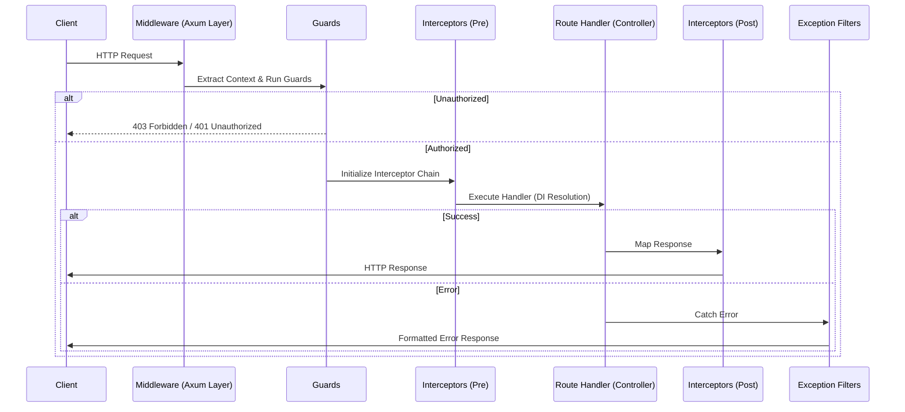

import { Aside } from "@astrojs/starlight/components";

# Architecture

NestForge is designed to be a **platform-agnostic** framework. While its primary use case is building HTTP APIs, its core architecture is decoupled from any specific transport. This allows NestForge patterns to be applied to GraphQL, gRPC, and even custom message buses.

## The Three Layers

The NestForge ecosystem is organized into three distinct layers:

1.  **Core Layer (`nestforge-core`)**: The brain of the framework. It handles the Module graph, Dependency Injection, Validation, and internal Pipeline abstractions. It has no knowledge of HTTP or Axum.
2.  **Runtime Layer (`nestforge-http`)**: The bridge to the world. It takes the Core model and mounts it onto a web server (Axum/Tokio).
3.  **Transport Layer**: Optional extensions for other protocols like `nestforge-graphql`, `nestforge-grpc`, and `nestforge-websockets`.

---

## Request Lifecycle

Understanding how a request moves through NestForge is crucial for debugging and designing efficient applications. Below is the sequence of events from when a request hits the server to when the response is sent back.



### 1. Middleware

Middleware is the first line of defense. In NestForge, these are standard Axum/Tower middlewares. They are perfect for low-level concerns like logging, CORS, or compression.

### 2. Guards

Guards have a single responsibility: determine whether a request should be handled by the route handler or not, based on certain conditions (e.g., roles, permissions).

### 3. Interceptors

Interceptors are powerful tools that allow you to:

- Bind extra logic before/after method execution.
- Transform the result returned from a function.
- Transform the exception thrown from a function.
- Extend basic function behavior.

### 4. Route Handler

This is where your business logic lives. Handlers use **Dependency Injection** to resolve the services they need to fulfill the request.

---

## Dependency Injection (DI)

NestForge features a robust DI system. Unlike many Rust frameworks that rely on global state, NestForge creates a **scoped container** for every request.

- **Singleton Providers**: Created once and shared across the entire application lifetime.
- **Request Providers**: Created once per request. Perfect for services that need to know about the current user or request ID.
- **Transient Providers**: A new instance is created every time it is injected.

```rust
// A service is just a struct registered as a provider
pub struct UsersService {
    db: Inject<Db>,
}

#[routes]
impl UsersController {
    // UsersService is automatically resolved from the container
    async fn get(users: Inject<UsersService>) -> ApiResult<UserDto> { ... }
}
```

## Platform Independence

The "Secret Sauce" of NestForge is that the **Module Graph** is resolved independently of the transport. This means you can write a service once and inject it into an HTTP Controller, a GraphQL Resolver, AND a gRPC Service simultaneously.

<Aside type="tip">
  By keeping your business logic in transport-agnostic Services, you make your
  application future-proof and significantly easier to unit test.
</Aside>
