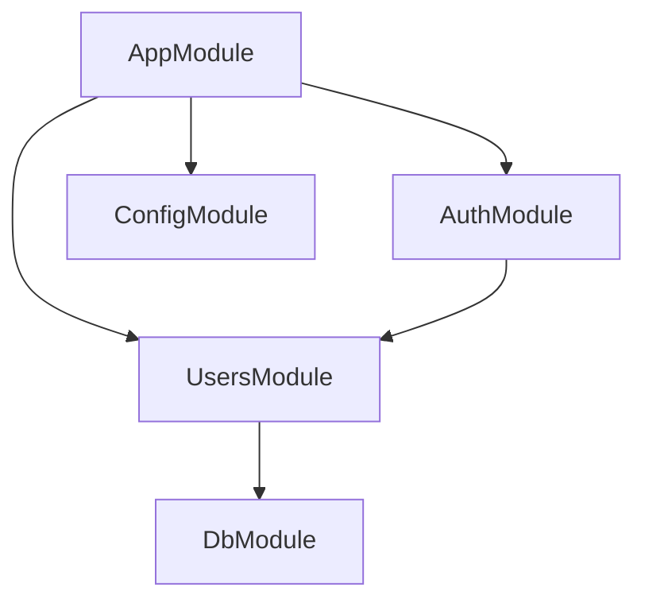

import { Aside } from "@astrojs/starlight/components";

# Modules

A module is a class (struct) annotated with a `#[module()]` macro. The `#[module()]` macro provides metadata that **NestForge** uses to organize the application structure.

## Overview

Each application has at least one module, a **root module**. The root module is the starting point used to build the **application graph**—the internal data structure NestForge uses to resolve module and provider relationships and dependencies.

While very small applications might theoretically have only the root module, this is not the typical case. We want to emphasize that modules are strongly recommended as an effective way to organize your components. Thus, for most applications, the resulting architecture will employ multiple modules, each encapsulating a closely related set of capabilities.



## The `#[module]` Macro

The macro takes four properties that describe the module:

| Property      | Description                                                                                                                   |
| ------------- | ----------------------------------------------------------------------------------------------------------------------------- |
| `imports`     | The list of imported modules that export the providers which are required in this module.                                     |
| `controllers` | The set of controllers defined in this module which have to be instantiated.                                                  |
| `providers`   | The providers that will be instantiated by the NestForge injector and that may be shared at least across this module.         |
| `exports`     | The subset of `providers` that are provided by this module and should be available in other modules which import this module. |

### Basic Example

```rust
#[module(
    imports = [DatabaseModule],
    controllers = [UsersController],
    providers = [UsersService],
    exports = [UsersService]
)]
pub struct UsersModule;
```

---

## Provider Scopes

In NestForge, providers can have different lifetimes. Choosing the right scope is essential for both performance and correctness.

### Singleton (Default)

A single instance of the provider is shared across the entire application. It is instantiated during application bootstrap.

### Request

A new instance of the provider is created for **every incoming request**. This instance is garbage collected after the request has finished processing. Use this when your service needs access to `RequestContext` (e.g., the current user).

### Transient

A new instance of the provider is created every time it is injected into another component.

---

## Feature Modules

A feature module simply organizes code relevant for a specific feature, keeping code organized and establishing clear boundaries. This helps us manage complexity and develop with **SOLID** principles.

```rust
// src/users/mod.rs
pub mod users_controller;
pub mod users_service;

use nestforge::module;
use self::users_controller::UsersController;
use self::users_service::UsersService;

#[module(
    controllers = [UsersController],
    providers = [UsersService],
    exports = [UsersService]
)]
pub struct UsersModule;
```

## Shared Modules

In NestForge, modules are **singletons** by default, and thus you can share the same instance of any provider between multiple modules effortlessly.

Once defined, the `UsersService` can be reused. To do so, we first need to **export** it, and then other modules can **import** `UsersModule`.

---

## Global Modules

If you have to import the same set of modules everywhere, it can get tedious. In NestJS-style frameworks, you can make a module **Global**.

```rust
#[module(
    providers = [ConfigService],
    exports = [ConfigService],
    global = true
)]
pub struct ConfigModule;
```

<Aside type="caution">
  Making everything global is not a good design decision. Global modules are
  available to diminish the amount of necessary boilerplate. The `imports` array
  is generally the preferred way to make the module's API available to
  consumers.
</Aside>

## Dynamic Modules

Dynamic modules allow you to create customizable modules that can register and configure providers dynamically. This is the equivalent of `forRoot()` or `register()` in NestJS.

```rust
impl DatabaseModule {
    pub fn for_root(options: DbOptions) -> DynamicModule {
        DynamicModule::builder()
            .module::<Self>()
            .providers([
                Provider::value(options)
            ])
            .exports([DbOptions])
            .build()
    }
}
```

---

## Lifecycle Hooks

Modules can hook into the application lifecycle to perform setup or cleanup tasks.

- `on_module_init()`: Called once the module has been initialized.
- `on_application_bootstrap()`: Called once the entire application has started.
- `on_module_destroy()`: Called before the module is destroyed.
- `on_application_shutdown()`: Called before the application shuts down.

```rust
impl OnModuleInit for UsersService {
    async fn on_module_init(&self, container: &Container) -> anyhow::Result<()> {
        println!("UsersService initialized!");
        Ok(())
    }
}
```
